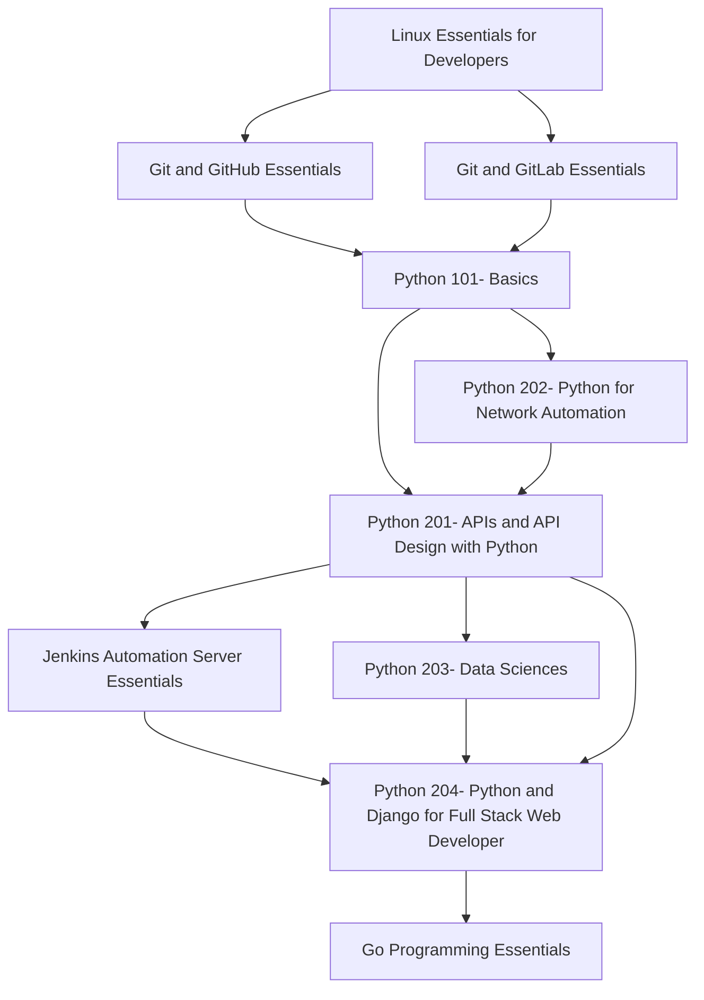
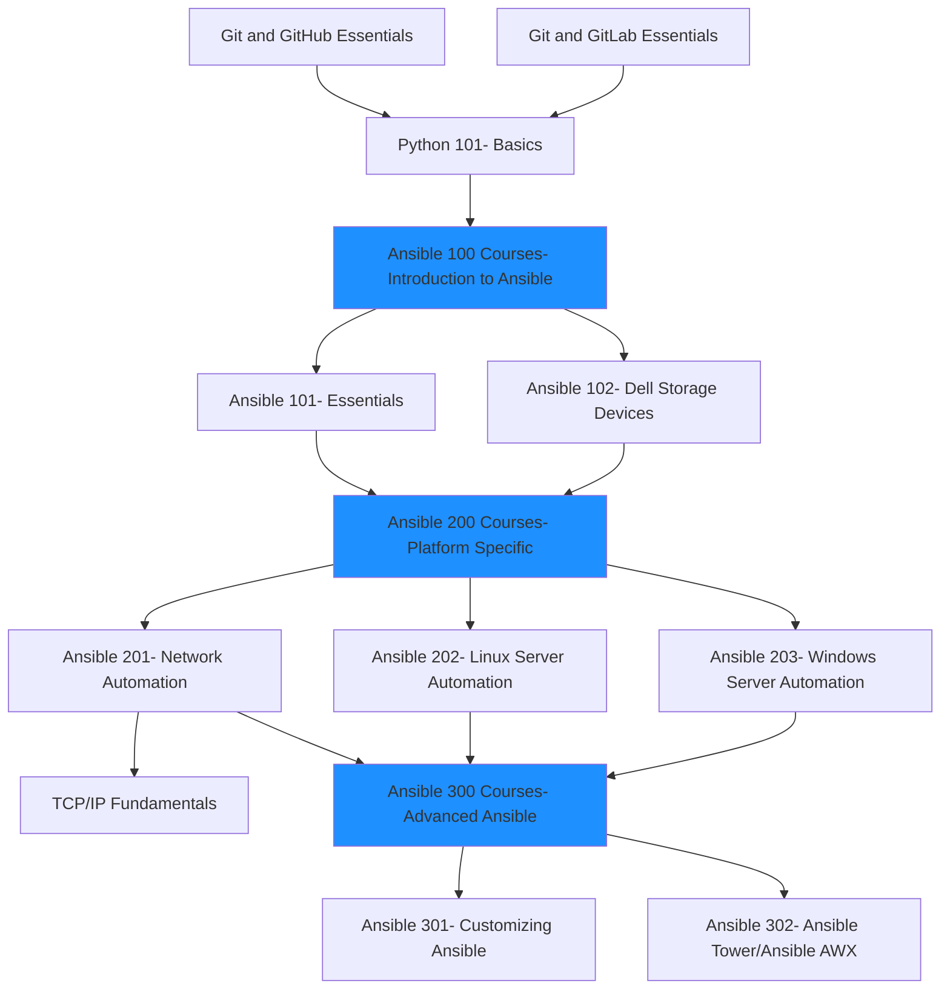
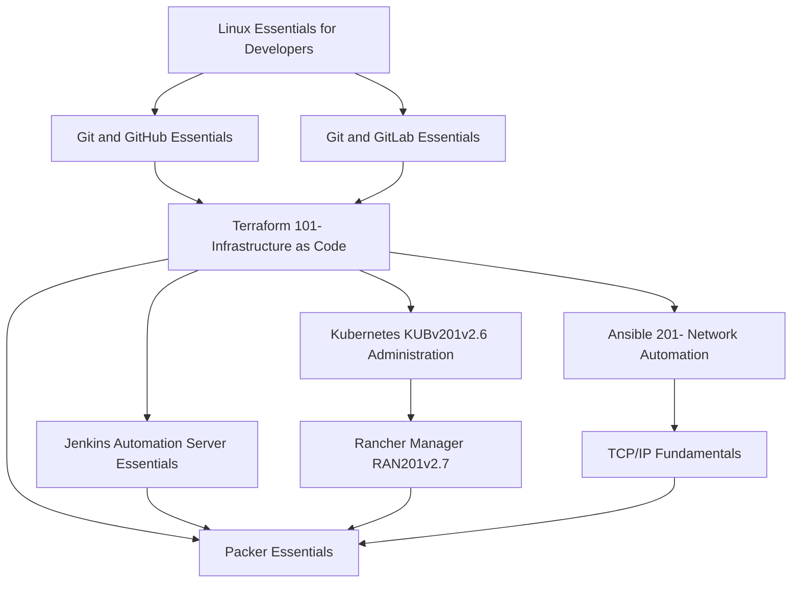

### [Developer Curriculum]( https://static.alta3.com/curriculum/Developer_path.html)
#### Courses:

- Linux Essentials for Developers
- Git and GitHub Essentials
- Git and GitLab Essentials
- Python 101- Basics
- Python 201- APIs and API Design with Python
- Python 202- Python for Network Automation
- Jenkins Automation Server Essentials
- Python 203- Data Sciences
- Python 204- Python and Django for Full Stack Web Developer
- Go Programming Essentials

### [NetDevOps Curriculum](https://static.alta3.com/curriculum/NetDevOps_path.html)
#### Courses:

- Git and GitHub Essentials
- Git and GitLab Essentials
- TCP/IP Fundamentals
- Python 101- Basics
- Ansible 101- Essentials
- Ansible 102- Dell Storage Devices
- Ansible 201- Network Automation
- Ansible 202- Linux Server Automation
- Ansible 203- Windows Server Automation
- Ansible 301- Customizing Ansible
- Ansible 302- Ansible Tower/Ansible AWX

### [Server Administration Curriculum](https://static.alta3.com/curriculum/ServerAdministration_path.html)
#### Courses:

- Linux Essentials for Developers 
- Git and GitHub Essentials
- Git and GitLab Essentials
- Terraform 101- Infrastructure as Code
- Kubernetes KUBv201v2.6 Administration
- Ansible 201- Network Automation
- TCP/IP Fundamentals
- Jenkins Automation Server Essentials
- Packer Essentials
- Rancher Manager RAN201v2.7

